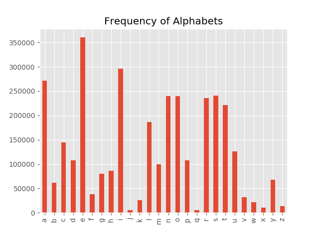

# On Anagram, Bi-Gram and er... One-gram?

Script to create all possible anagrams of same length as given word
and check with a dictionary file for english words from the list.
Tested with Python3

Usage:
```
$ python3 anagrams.py
Enter word : putercom
40320 combinations of words from putercom

Enter path to dictionary file : ../../words.txt
List of possible words:
 {'computer'}
```

## Word Analysis (Two Letter Bi-Grams)
Let's create a frequency count of all consecutive letters in the english dictionary. For our analysis, I am using the words.txt file. Some variations in what we see may occur depending on the training file used.

```
In [18]: from collections import Counter 

In [19]: with open('words.txt') as f:                                           
    ...:     en_words = set(word.strip().lower() for word in f)

enwords_file = 'words.txt'
with open(enwords_file) as f:
    english_words = set(word.strip().lower() for word in f)

In [20]: two_letter_grams = [w[i:i+2] for w in en_words for i in range(0, len(w)
    ...: -1) if w[i:i+2].isalpha()]

In [21]: two_letter_grams
Out[21]: 
['la',
 'ab',
 'ba',
 'ad',
 'di',
 ...]

In [22]: en_hist = Counter(two_letter_grams)

In [23]: en_hist
Out[23]: 
Counter({'aa': 213,
         'ab': 12958,
         'ac': 16417,
         'ad': 9278,
	 ...

```

Let's load into a Pandas DataFrame for analysis.

```
In [22]: df = df.T

In [23]: df.head()
Out[23]: 
        0
aa    213
ab  12958
ac  16417
ad   9278
ae   2863

In [24]: df.describe()
Out[24]: 
                  0
count    654.000000
mean    4579.432722
std     8567.377785
min        1.000000
25%       61.250000
50%      869.500000
75%     4807.000000
max    64994.000000

```

Let's find out which pair of consecutive letters are the least occurring and most occurring. If we sort the DataFrame we can also see the most common and least common bi-grams as computed from the dictionary file we are using.

```
In [25]: df[df.values == 1]
Out[25]: 
    0
cx  1
gq  1
jv  1
jw  1
kq  1
kx  1
kz  1
mx  1
px  1
pz  1
qf  1
qg  1
qm  1
qy  1
vb  1
vh  1
wv  1
xk  1
xz  1

In [26]: df[df.values == 64994]
Out[26]: 
        0
er  64994

In [28]: df.sort_values(df.columns[0])
Out[28]: 
        0
vb      1
jv      1
wv      1
jw      1
cx      1
kq      1
kx      1
xz      1
kz      1
vh      1
qy      1
qm      1
xk      1
mx      1
gq      1
qg      1
px      1
pz      1
qf      1
...
...
ql      2
wq      2
jp      2
cv      2
jb      2
qd      2
zj      2
jl      2
fv      2
jg      2
dx      2
..    ...
at  41186
te  43022
es  45671
on  45681
ti  48342
in  59417
er  64994

[654 rows x 1 columns]

```
As expected 'er', 'on', 'in' are some of the bi-grams frequently occurring.

## Frequency of occurrence of the Alphabet
Let's find the frequency of occurrence of each alphabet in the english dictionary file we are using.

```
In [70]: one_grams = [a for w in en_words for a in w if w.isalpha()]

In [71]: Counter(one_grams)
Out[71]: 
Counter({'a': 270975,
         'b': 61279,
         'c': 144762,
         'd': 107333,
         'e': 360300,
         'f': 38425,
         'g': 79677,
         'h': 85871,
         'i': 295531,
         'j': 5012,
         'k': 25381,
         'l': 186291,
         'm': 99061,
         'n': 240045,
         'o': 239547,
         'p': 108089,
         'q': 5648,
         'r': 235579,
         's': 240329,
         't': 221551,
         'u': 125696,
         'v': 32174,
         'w': 21814,
         'x': 10038,
         'y': 67441,
         'z': 13872})

```

Let's plot the distribution of the letters as seen in this dictionary.

```
In [120]: df_alpha = pd.DataFrame([Counter(one_grams)])
In [121]: df_alpha = df_alpha.T
In [122]: df_alpha.plot(kind='bar', legend=False, title='Frequency of Alphabets')
```



This is a trimodal distribution and agrees quite closely with the distribution in [Wikipedia](https://en.wikipedia.org/wiki/Frequency_analysis).

### References
1. "words.txt" file from https://github.com/dwyl/english-words. Please see license info on that page.
2. https://en.wikipedia.org/wiki/Frequency_analysis